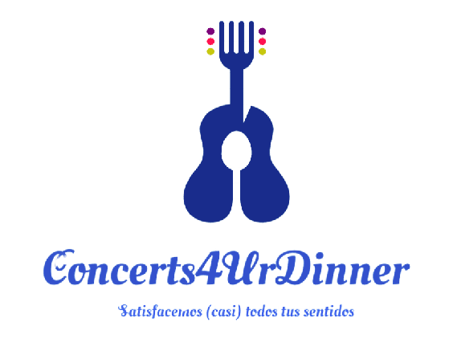

# DIU22
Prácticas Diseño Interfaces de Usuario 2021-22 (Tema: Hostels) 

Grupo: DIU3.3Mosqueteros.  Curso: 2021/22 
Updated: 11/2/2022

Proyecto: 
>>> Concerts4UrDinner

Descripción: 

>>> Hemos ideado una app para el móvil, a través de la cual podremos ver los eventos que esten planificados y reservar mesa. Podremos ver 
>>> información más específica de cada evento. También podremos ver el menú y ofertas. 

Logotipo: 
>>> 

Miembros
 * :bust_in_silhouette:   Mario Gil Guerrero     :octocat:     
 * :bust_in_silhouette:  Jose Abela Cánovas     :octocat:

----- 

# Proceso de Diseño 

## Paso 1. UX Desk Research & Analisis 

 1.a Competitive Analysis
-----

Hemos elegido otros hosteles que se encuentran en Granada, por lo que le hacen la competencia directa al nuestro. Podemos ver cómo en cada página web podemos ver que faltan opciones que en otras si están, por lo que es difícil decidir cuál está mejor diseñada.

 1.b Personas
-----
>>> **Susana**
>>> 
>>> Hemos escogido a Susana debido a que las personas dispuestas a conocer otra gente con la que convivan son un claro objetivo de los hosteles.
>>>  
>>> 
>>> 
>>> **Emilio**
>>> 
>>> Hemos escogido a Emilio porque otro de los objetivos de los hosteles es atraer un público que no puede permitirse alojamientos de un gran presupuesto, y que
necesitan algo más económico para poder quedarse donde necesiten.
>>> 

 1.c User Journey Map
----
>>> **Susana**
>>> 
>>> Susana va al 4uHostel porque es barato, hay bar y tiene un parking cercano.
>>>  
>>> 
>>> 
>>> **Emilio**
>>> 
>>> Emilio se interesa por este hostel ya que hay conciertos y la oportunidad de conocer gente nueva con la que inspirarse.
>>> 

 1.d Usability Review
----
>>> - Enlace al documento:  https://github.com/mario-gil/DIU/blob/master/P1/Usability-review.pdf
>>> - Valoración final (numérica): 84
>>> - Comentario sobre la valoración:  El sitio web es aceptable para cualquier tipo de usuario, pero tiene ciertos problemas como
el color/tamaño del texto o que tiene dos páginas web diferentes.

## Paso 2. UX Design  

 2.a Feedback Capture Grid / EMpathy map / POV
----

>>> 
  
    
>>> El problema es que en la web no hay ninguna información sobre los eventos que están organizados.
>>> 
>>>  Nos planteamos que, con un buen sistema para informar a los clientes y que les permita reservar sitio, más gente casual
>>>  podrá acercarse para este tipo de eventos

 2.b ScopeCanvas
----
>>> 

 2.b Tasks analysis 
-----

>>> 

 2.c IA: Sitemap + Labelling 
----

>>> 

Término | Significado     
| ------------- | -------
  Inicio  | Página principal del sitio. Se describen las funcionalidades de la aplicación, los protocolos Covid seguidos, enlaces a los distintos lugares de la página...
  Calendario Eventos | Calendario que mostrará en qué días hay un evento y permitirá ver información sobre ellos
  Sobre Nosotros | Información sobre el equipo, así como el proyecto.
  FAQ | Listado de preguntas habituales relacionadas con el uso de la aplicación junto con sus respuestas.
  Contacto | Información de contacto para poder recibir asistencia.
  RRSS | Enlaces a las redes sociales del proyecto.
  Artistas | Información del artista del evento seleccionado.
  Reservar | Se muestra una página similar a un carrito de la compra, con el nombre, fecha, descripción, foto del evento, el número de asientos y la opción de pagar.
  Pago | Realizar el pago de la reserva especificada.
  Menú | Información con los platos que se sirven en el restaurante, así como ofertas temporales.
  Platos | Muestra la información, así como alérgenos, específicos de cada plato.
  Ofertas | Promociones en algún plato del restaurante.

 2.d Wireframes
-----

Página Principal

Menú lateral

Calendario Eventos

Calendario Eventos Seleccionado

Calendario Artista

Menú Carta

Reserva

## Paso 3. Mi UX-Case Study (diseño)

 3.a Moodboard
-----

  3.b Landing Page
----

Puede ver el landing page pinchando aquí: [Concerts4UrDinenr](https://joses-supercool-site-ea3bcf.webflow.io/)

 3.c Guidelines
----

Hemos elegido colores oscuros y fuertes, pero sin que lleguen a molestar a la vista. Estos colores quedan bien para nuestro tipo de web, ya que nos recuerdan a la noche y luces que podrían haber en un concierto.
En la práctica, necesitaríamos al menos un color más para elementos como avisos, así como definir unos 7 shades de cada tonalidad. El proceso a seguir sería similar al que muestra RefactoringUI en su artículo.

Principalmente usaremos 2 tipografías:
Para los títulos es Oleo Script Swash Caps. Es un tipo de letra elegante y atractiva, a la vez que casual, que es lo que buscábamos nosotros.
Para el cuerpo usaremos Patrick Hand. Es una fuente casual pero manteniendo un cierto estilo, perfecta para nuestra página dirigida a un público más joven. Está basada en la escritura del propio diseñador.

El lenguaje usado en toda la aplicación será coloquial, sin tecnicismos.
La página debe ser posible de usar fácilmente por cualquier tipo de persona.

  3.d Mockup
----
Hemos creado una aplicación móvil usando Figma para el diseño y ProtoPie para añadir la interactividad.

Puede ver la aplicación pinchando aquí: [Concerts4UrDinner](https://cloud.protopie.io/p/20c104b2c7)

 3.e ¿My UX-Case Study?
-----
Aquí tenemos un video en el que se puede ver toda la funcionalidad de la aplicación:

https://user-images.githubusercontent.com/100839792/169661029-0fa235ce-47f6-45a7-92d5-e25b4ea6f3df.mp4

## Paso 4. Evaluación 

 4.a Caso asignado
----

>>> Vamos a evaluar la web Experience4u, se trata de un minisite orientado a poner de manifiesto las diferentes actividades que se presenta en el establecimiento de
>>> Hostel4u como en la ciudad de Granada en general. Las actividades pueden ser tanto culturales como gastronómicas o de ocio. Algunas actividades son organizadas por
>>> el propio hostel y otras no.

 4.b User Testing
----

>>> Seleccione 4 personas ficticias. Exprese las ideas de posibles situaciones conflictivas de esa persona en las propuestas evaluadas. Asigne dos a Caso A y 2 al caso B
 

| Usuarios | Sexo/Edad     | Ocupación   |  Exp.TIC    | Personalidad | Plataforma | TestA/B
| ------------- | -------- | ----------- | ----------- | -----------  | ---------- | ----
| User1 | H / 40   | Oficina  |  Avanzada | Gruñón       | App  | A
| User2  | Familia Joven   | Profesores  | Media       | Alegre       | App        | A 
| User3  | Grupo de Senderismo   | Variada     | Intermedia        | Alegre    | Web      | B 
| User4  | M / 80   | Jubilada     | Baja  | Alegre     | móvil        | B 

. 4.c Cuestionario SUS
----

A la vista de los usuarios entrevistados, podríamos concluir que ambas aplicaciones están a la altura, son buenas aplicaciones en cuanto al diseño de la UI, la aplicación A cumple con su interfaz móvil, mientras que la aplicación B incluye tanto interfaz web como móvil, aunque la referente al móvil llega a ser un tanto confusa en ciertos aspectos que analizamos en su informe.

En la aplicación A parece que resulta una aplicación que no será muy frecuentada por los usuarios entrevistados, puesto que el target de la aplicación suele ser gente joven, sociable y animada.

En la aplicación B, un usuario resultó ser una señora con poca costumbre de frecuentar aplicaciones y páginas web, por lo que perjudicó la media de su nota. Sin embargo, como el target de la aplicación no incluye a la señora, se puede tomar con menos valor su puntuación, mientras que como el grupo de senderistas es el objetivo claro del servicio, se deberíá de tomar con mayor importancia sus críticas.

 4.d Usability Report
----

Añadir report de usabilidad para práctica B (la de los compañeros)

En definitiva, la página web cumple con los requisitos que se propone, y consta de un buen diseño de UI para ordenador, aunque para dispositivos móviles a veces no se adapta correctamente. Cabe destacar que la estética de la aplicación web encaja bien con la página de 4UHostel, y queda un resultado realmente profesional. Sin embargo, tiene algunos fallos, entre los que destacamos el gran tamaño del header y footer, con mucho hueco en blanco sin aprovechar. También tiene ciertos enlaces repetidos que llevan al mismo lugar, y otros que, aun llamándose de la misma forma, te llevan a sitios distintos. Pero en general la experiencia en la página es más que satisfactoria, siempre que sea en PC y no en móvil.

## Conclusión final / Valoración de las prácticas

>>> (90-150 palabras) Opinión del proceso de desarrollo de diseño siguiendo metodología UX y valoración (positiva /negativa) de los resultados obtenidos  

